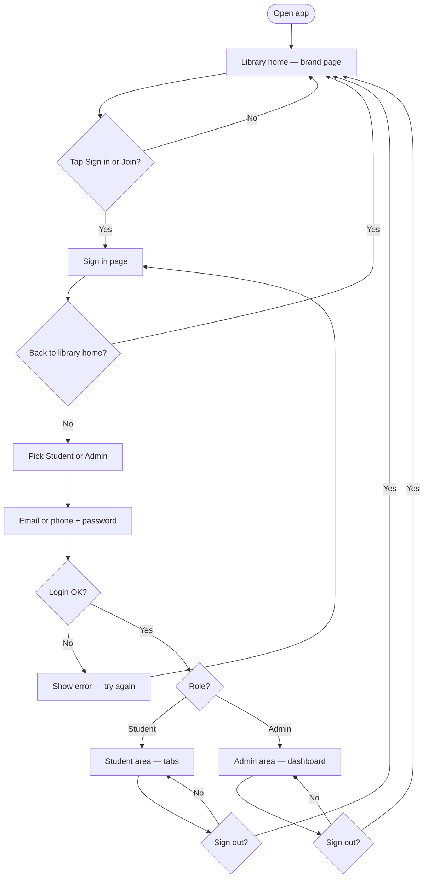

# Mani Library app — user flow

Simple flow: **brand page first**, then **Sign in**, then **Student** or **Admin** based on role. Sign out returns to the brand page.

## Flowchart (Mermaid)

Paste into [mermaid.live](https://mermaid.live), GitHub, Notion, or any Mermaid viewer.

## Plain language

1. Open the app → you land on the **library home** (branding: story, facilities, contact). No account needed.
2. Tap **Sign in** or **Join** → **Sign in** screen: choose **Student** or **Admin**, enter details.
3. If login succeeds → **Student** sees student tabs; **Admin** sees the admin shell.
4. **Sign out** → back to **library home** (brand page).

## How this maps in the codebase

| Step | Route / behavior |
|------|------------------|
| Library home (cold start) | `app/_layout.tsx` — `initialRouteName: '(student)'`; Home tab is `app/(student)/index.tsx` → `LandingScreen` |
| Sign in | `app/(auth)/login.tsx`; entry from landing links to `/(auth)/login` |
| After login | `AuthProvider` — `router.replace` to `/(student)` or `/(admin)` from server/user role |
| Sign out | `AuthProvider` — `router.replace('/(student)')` |
| Signed out but opened admin URL | `app/(admin)/_layout.tsx` — `Redirect` to `/(student)` |
