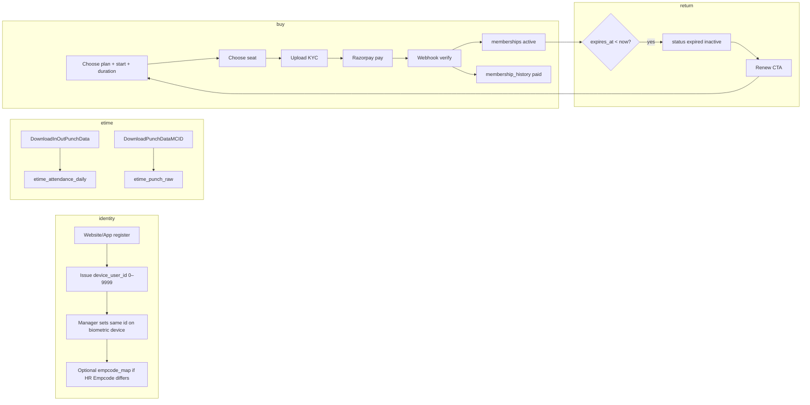

# Library membership launch playbook

**Scope:** eTimeOffice punch APIs + Supabase + Razorpay + student app (registration name, issued `device_user_id` 0–9999, device binding, plans, seat, payment, renewals, short-term shifts vs long-term 12h access, inactive users).

**Audience:** You (owner) + backend implementer. This doc is **runbook + schema + flows** only—no code changes in this file.

---

## Part A — Fix first (do these before “launch flow”)

Order matters. If you skip a row, you will get duplicate members, wrong seat billing, or webhook fraud.

| # | Gap | Why it blocks launch | Fix |
|---|-----|----------------------|-----|
| A1 | **Single source of truth for `device_user_id`** | Device, website, and app must agree on the same integer (0–9999). | Define rule: `device_user_id` is issued **once** in Supabase; device enrollment **must** type the same value (or you maintain an `empcode ↔ device_user_id` map—see §3). |
| A2 | **Device password ≠ app password** | Managers must not confuse biometric device login with student app login. | Document SOP: device = local operator PIN; app = Supabase Auth (email/phone). Never sync passwords. |
| A3 | **Name drift** | API returns `Name` (e.g. `Empname0002`); registration may use real name. | Decide policy: **(i)** force registration display name to match device export after first link, or **(ii)** store `etime_display_name` separately and show both until admin verifies. |
| A4 | **Two eTime endpoints, two meanings** | `InOutPunchData` = derived day (no raw punch); `PunchData` = raw events. | Ingest both but **never** double-count attendance for billing; use one as source for “present day” and the other for audit. |
| A5 | **Razorpay webhook signature + idempotency** | Without it, double payment extends membership twice. | Verify signature; store `razorpay_payment_id` unique; mark invoice `paid` once. |
| A6 | **Row-level security (RLS)** on Supabase | Students must only read their rows. | Enable RLS on all membership tables; policies on `auth.uid()` → `profiles.user_id`. |
| A7 | **Timezone** | `DateString` / `PunchDate` are local office time. | Store `timestamptz` in UTC + `office_tz` column or env `LIBRARY_TZ=Asia/Kolkata`. |
| A8 | **“Empcode=ALL” + `IsAdmin: true`** | Your sample implies admin token on URL—risk if URL leaks. | Prefer server-side proxy: Edge Function holds eTime credentials; app never sees full URL with secrets. |

**After A1–A8:** the flow in Part H is the “official” launch sequence.

---

## Part B — eTimeOffice API (contract you shared)

### B1. In / out summary (user does **not** need to punch raw)

**URL pattern (example):**

`GET https://api.etimeoffice.com/api/DownloadInOutPunchData?Empcode=ALL&FromDate=DD/MM/YYYY&ToDate=DD/MM/YYYY`

**Top-level:** `InOutPunchData[]`, `Error`, `Msg`, `IsAdmin`.

| Field | Meaning (for your product) |
|-------|------------------------------|
| `Empcode` | Employee / terminal code from device (e.g. `0002`). **Link key** to your `device_user_id` or mapping table. |
| `INTime` / `OUTTime` | First in / last out of day (`--:--` if absent). |
| `WorkTime` | Net worked span. |
| `OverTime` | OT. |
| `BreakTime` | Break. |
| `Status` | **`P`** = Present (worked), **`A`** = Absent (see `0003` sample)—use for **attendance / compliance**, optional for **membership active** if you ever gate access on presence. |
| `DateString` | Calendar date string. |
| `Remark` | Free text (e.g. `LT-EO`). |
| `Erl_Out` / `Late_In` | Policy fields from HR system. |
| `Name` | Label from HR—should **match** registered name after normalization (see A3). |

### B2. Raw punch stream (user **needs** to punch)

**URL pattern (example):**

`GET https://api.etimeoffice.com/api/DownloadPunchDataMCID?Empcode=ALL&FromDate=DD/MM/YYYY_HH:mm&ToDate=DD/MM/YYYY_HH:mm`

**Top-level:** `PunchData[]`, `Error`, `Msg`, `IsAdmin`.

| Field | Meaning |
|-------|---------|
| `Name` | Same family as B1. |
| `Empcode` | Same link key. |
| `PunchDate` | Full datetime of punch. |
| `M_Flag` | Vendor flag (nullable)—store raw. |
| `mcid` | Machine / reader id—useful if you have multiple gates. |

**Ingestion rule:** append-only `etime_punch_raw` rows; nightly or hourly job also pulls B1 for **daily rollup** into `etime_attendance_daily` (see §5 SQL).

---

## Part C — Identity model (device ↔ app ↔ Supabase)

### C1. Recommended identifiers

| Concept | Example | Stored where |
|---------|---------|--------------|
| **Supabase Auth user** | UUID | `auth.users` |
| **Profile** | 1:1 with auth user | `public.profiles` |
| **`device_user_id`** | `0002`, `1042`, … (int 0–9999, unique) | `public.profiles.device_user_id` (Mani Library also uses `public.etime_empcode_map` when Empcode ≠ numeric id) |
| **eTime `Empcode`** | `0002` (zero-padded string) | `public.empcode_map.empcode` UNIQUE → `device_user_id` |

**Enrollment SOP (face/fingerprint on device):**

1. Admin creates user in Supabase (or user self-registers on website).
2. System allocates next `device_user_id` via `device_user_id_seq` (0–9999).
3. Admin programs **the same numeric string** on the terminal (as `Empcode` or vendor-equivalent field—depends on device; if device only accepts 4-digit HR code, use **`empcode_map`**).
4. Registration **full name** should match what HR exports in `Name`, or you accept mismatch and store `name_official` vs `name_preferred`.

### C2. “Password on device” vs “password on app”

- **Device:** operator PIN / device admin password—**out of scope** for Supabase.
- **App / website:** Supabase Auth password or OTP—**only** credential for API calls from mobile app.

---

## Part D — Membership product rules (short-term vs long-term)

### D1. Short-term (shift-wise)

- Sell **entitlements** bound to: `plan_id`, `valid_from`, `valid_to`, **`shift_id`** (morning / evening / custom window), optional **`seat_code`** for rows map (`S…`).
- **Access check:** “now ∈ shift window AND within `valid_from`/`valid_to` AND seat matches if assigned.”
- **Renewal:** new row or extend `valid_to`; if shift changes mid-period, create **amendment** ledger line.

### D2. Long-term (12-hour / half-day style)

- Plans like “half day” = **fixed daily window** (e.g. 08:00–20:00)—store `access_start_time`, `access_end_time` on `membership_plans` or `membership_entitlements`.
- **Full day** = 24h window or library policy window.
- **Inactive:** `expires_at < now()` OR admin-set `status = suspended`—see Part F.

### D3. Deciding “inactive user”

**Recommended (simple, auditable):**

- **Financial inactive:** `memberships.status = 'expired'` when `expires_at < now()` (cron or query).
- **Access inactive:** same + optionally `last_allowed_entry_at` if you integrate turnstile.
- **Do not** mark inactive solely from eTime `Status = 'A'` unless product explicitly says “no punch = freeze membership” (usually unfair if they paid).

---

## Part E — Returning user (many months later)

1. User signs in with Supabase Auth (same account).
2. App loads `GET /membership/current` → if `expired` or `none` but **history exists**, show **Past membership** (read-only) + **Renew** CTA.
3. Renew: Razorpay checkout → webhook → new `memberships` row (or extend) + `membership_history` line `kind = renewal`, `status = paid`.
4. Optionally re-link seat on renewal if policy allows seat change.

---

## Part F — Razorpay + Supabase (events)

1. **Client:** create order via Edge Function `POST /checkout/create` (amount, `plan_id`, seat/start, `intent`; server resolves `user_id` / `device_user_id` from the JWT + `profiles`).
2. **Razorpay:** user pays; client receives `razorpay_payment_id`.
3. **Server:** Edge Function `POST /checkout/verify` verifies signature, inserts `payments` + updates `membership_history` + `memberships`.
4. **Webhook:** `payment.captured` as backup idempotency (same `razorpay_payment_id`).

---

## Part G — Supabase schema (tables + purpose)

Below is a **minimal** relational model. Adjust names to your taste; keep **unique** constraints shown.

### G1. Entity list

| Table | Purpose |
|-------|---------|
| `profiles` | App user; links `auth.users.id`; holds `device_user_id`, display name, phone, etc. |
| `empcode_map` | Maps eTime `Empcode` string → `device_user_id` (if they differ). |
| `membership_plans` | Catalog: duration, access window, shift template, price metadata. |
| `memberships` | Current or historical entitlement periods (you may split “current” view in SQL). |
| `membership_entitlements` | Optional: shift windows / seat for short-term rows. |
| `membership_history` | Ledger: payment, renewal, adjustment (matches app `MembershipHistoryEntry`). |
| `payments` | Razorpay ids, amounts, status. |
| `identity_documents` | Aadhaar / student id pipeline. |
| `etime_attendance_daily` | Rollup from B1 API. |
| `etime_punch_raw` | Rows from B2 API. |

### G2. SQL (Postgres / Supabase) — create in order

> Run in Supabase SQL editor or `supabase/migrations`. Enable `uuid-ossp` or use `gen_random_uuid()`.

```sql
-- 1) Profiles (1:1 auth.users — create trigger on signup in app docs)
create table if not exists public.profiles (
  user_id uuid primary key references auth.users (id) on delete cascade,
  device_user_id int unique check (device_user_id >= 0 and device_user_id <= 9999),
  full_name text not null,
  phone text,
  created_at timestamptz not null default now(),
  updated_at timestamptz not null default now()
);

-- 2) eTime code map (when Empcode on device ≠ device_user_id)
create table if not exists public.empcode_map (
  empcode text primary key,
  device_user_id int not null references public.profiles (device_user_id) on update cascade,
  created_at timestamptz not null default now()
);

-- 3) Plans
create type plan_access_tier as enum ('full_day', 'half_day', 'shift_bundle', 'hour_bundle');

create table if not exists public.membership_plans (
  id text primary key, -- month_full | month_half | ...
  title text not null,
  access_tier plan_access_tier not null,
  duration_days int not null,
  access_start_time time null, -- for half_day / shifts
  access_end_time time null,
  price_paise bigint,
  active boolean not null default true
);

-- 4) Membership periods
create type membership_status as enum ('pending_payment', 'active', 'expiring_soon', 'expired', 'cancelled');

create table if not exists public.memberships (
  id uuid primary key default gen_random_uuid(),
  user_id uuid not null references auth.users (id) on delete restrict,
  plan_id text not null references public.membership_plans (id),
  status membership_status not null default 'pending_payment',
  starts_at timestamptz not null,
  expires_at timestamptz not null,
  seat_code text, -- F12 / S12
  floor_label text,
  created_at timestamptz not null default now(),
  updated_at timestamptz not null default now()
);
create index if not exists memberships_user_dates on public.memberships (user_id, starts_at desc);

-- 5) Optional entitlements (short-term shifts)
create table if not exists public.membership_entitlements (
  id uuid primary key default gen_random_uuid(),
  membership_id uuid not null references public.memberships (id) on delete cascade,
  shift_label text, -- e.g. Morning
  window_start time not null,
  window_end time not null,
  weekdays int[] -- 0=Sun .. 6=Sat, optional
);

-- 6) Ledger / history
create type history_kind as enum ('payment', 'renewal', 'adjustment');
create type history_status as enum ('paid', 'pending', 'failed', 'refunded');

create table if not exists public.membership_history (
  id uuid primary key default gen_random_uuid(),
  user_id uuid not null references auth.users (id) on delete restrict,
  membership_id uuid references public.memberships (id),
  kind history_kind not null,
  title text not null,
  occurred_at timestamptz not null default now(),
  plan_name text,
  amount_paise bigint,
  currency text not null default 'INR',
  status history_status not null default 'pending',
  period_label text,
  receipt_id text,
  razorpay_order_id text,
  razorpay_payment_id text unique,
  metadata jsonb,
  created_at timestamptz not null default now()
);
create index if not exists membership_history_user_time on public.membership_history (user_id, occurred_at desc);

-- 7) Payments (optional split from history)
create table if not exists public.payments (
  id uuid primary key default gen_random_uuid(),
  user_id uuid not null references auth.users (id),
  membership_history_id uuid references public.membership_history (id),
  razorpay_order_id text,
  razorpay_payment_id text unique,
  amount_paise bigint not null,
  status history_status not null,
  raw jsonb,
  created_at timestamptz not null default now()
);

-- 8) Identity docs
create type doc_type as enum ('aadhaar', 'student_id');
create type doc_status as enum ('not_uploaded', 'pending', 'verified', 'rejected');

create table if not exists public.identity_documents (
  id uuid primary key default gen_random_uuid(),
  user_id uuid not null references auth.users (id) on delete cascade,
  type doc_type not null,
  status doc_status not null default 'not_uploaded',
  storage_path text,
  updated_at timestamptz not null default now(),
  rejection_reason text,
  unique (user_id, type)
);

-- 9) eTime daily rollup (B1)
create table if not exists public.etime_attendance_daily (
  id bigserial primary key,
  empcode text not null,
  device_user_id int references public.profiles (device_user_id),
  work_date date not null,
  in_time text,
  out_time text,
  work_time text,
  status text, -- P / A
  remark text,
  raw jsonb not null,
  fetched_at timestamptz not null default now(),
  unique (empcode, work_date)
);

-- 10) eTime raw punches (B2)
create table if not exists public.etime_punch_raw (
  id bigserial primary key,
  empcode text not null,
  device_user_id int references public.profiles (device_user_id),
  punch_at timestamptz not null,
  mcid text,
  raw jsonb not null,
  unique (empcode, punch_at, mcid)
);
```

### G3. RLS (sketch—implement with your team)

- `profiles`: `select/update` where `auth.uid() = user_id`.
- `memberships`, `membership_history`, `payments`, `identity_documents`: same.
- `etime_*`: usually **service role only** (Edge Function ingests); **do not** expose to client if contains all employees (`Empcode=ALL`).

### G4. Useful queries

**Next `device_user_id`:**

```sql
select coalesce(max(device_user_id), -1) + 1 as next_device_user_id from public.profiles;
```

**Current membership for API (`/membership/current`):**

```sql
select m.*
from public.memberships m
where m.user_id = $1
  and m.status in ('active', 'expiring_soon')
order by m.expires_at desc
limit 1;
```

**Mark expired (cron daily):**

```sql
update public.memberships
set status = 'expired', updated_at = now()
where status in ('active', 'expiring_soon')
  and expires_at < now();
```

**History for app:**

```sql
select *
from public.membership_history
where user_id = $1
order by occurred_at desc
limit 100;
```

---

## Part H — Launch runbook (step-by-step)

1. **Supabase project:** create; note URL + `anon` key + `service_role` (server only).
2. **Run SQL** from §G2 in migrations; add RLS §G3.
3. **Auth:** enable email/phone providers you need; test sign-up.
4. **Storage bucket** for `identity_documents` uploads; signed URLs from Edge Functions.
5. **Edge Functions:**
   - `etime-sync-inout` — calls B1 with **server secret**; upserts `etime_attendance_daily`.
   - `etime-sync-punch` — calls B2; inserts `etime_punch_raw`.
   - `checkout-create` / `checkout-verify` — Razorpay order + verify + write `membership_history` + `memberships`.
   - `razorpay-webhook` — idempotent capture handler.
6. **Cron:** Supabase `pg_cron` or external scheduler: daily **expire** job (SQL §G4) + eTime pulls.
7. **App env:** fill `.env` / EAS secrets (§I).
8. **Wire app** `EXPO_PUBLIC_API_BASE_URL` to your Edge API base (not raw eTime URL).
9. **Pilot:** 10 real users: allocate `device_user_id`, enroll device, buy plan, pay, verify `memberships` row + webhook.

---

## Part I — Environment variables (checklist)

**Expo / student app (public only where safe):**

| Variable | Example | Who consumes |
|----------|---------|--------------|
| `EXPO_PUBLIC_API_BASE_URL` | `https://xxxx.supabase.co/functions/v1` | App `lib/api.ts` |
| `EXPO_PUBLIC_SUPABASE_URL` | Supabase project URL | If you use client Supabase |
| `EXPO_PUBLIC_SUPABASE_ANON_KEY` | anon key | Client (RLS-safe) |

**Never in the app bundle:**

| Secret | Where |
|--------|--------|
| `ETIME_API_KEY` / basic auth / whatever vendor needs | Edge Function secrets |
| `RAZORPAY_KEY_ID` + `RAZORPAY_KEY_SECRET` | Edge Function secrets |
| `SUPABASE_SERVICE_ROLE_KEY` | Edge Functions only |
| `RAZORPAY_WEBHOOK_SECRET` | Webhook function |

**Operational:**

| Variable | Purpose |
|----------|---------|
| `LIBRARY_TZ` | `Asia/Kolkata` (or your zone) for parsing eTime dates |
| `LIBRARY_DEVICE_USER_ID` | Documented range 0–9999; sequence `device_user_id_seq` in SQL |

---

## Part J — App / website design changes (checklist)

| Area | Change |
|------|--------|
| **Registration** | Capture `full_name` with warning: “Must match office attendance name” or show eTime `Name` after link. |
| **Admin** | Screen: “Assign next `device_user_id`” + print QR / sticker for device enrollment. |
| **Membership** | After Supabase is live, replace mock `api.membership` with real JWT to Edge; show **Past periods** from `membership_history` when current `expired` / `none`. |
| **Plans** | Add **start date** + **duration** picker (you asked for “choose date of membership duration”)—today app uses plan catalog without custom start; **add UI + API**. |
| **Seat** | Persist `seat_code` + `plan_id` on checkout draft until payment captured. |
| **Settings** | “Link my Empcode” flow if `empcode_map` needed. |

---

## Part K — Mermaid (high level)



---

## Part L — What you asked “fix first” → then this doc is the flow

If anything below is false, **stop** and fix it before scaling users.

- [ ] `device_user_id` allocation is atomic (no two users get same number).
- [ ] eTime credentials never ship in the mobile app.
- [ ] Razorpay webhook + verify path both enforce **idempotency** on `razorpay_payment_id`.
- [ ] RLS enabled on all PII tables.
- [ ] You have a written rule for **short-term shift** vs **long-term window** in `membership_plans` / `membership_entitlements`.
- [ ] Expiry job runs daily and matches what the app shows (`expired` vs `none`).

---

*End of playbook. Update this file when eTime or Razorpay changes their payload or auth scheme.*
