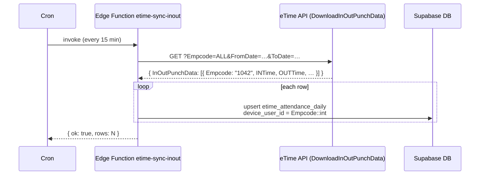
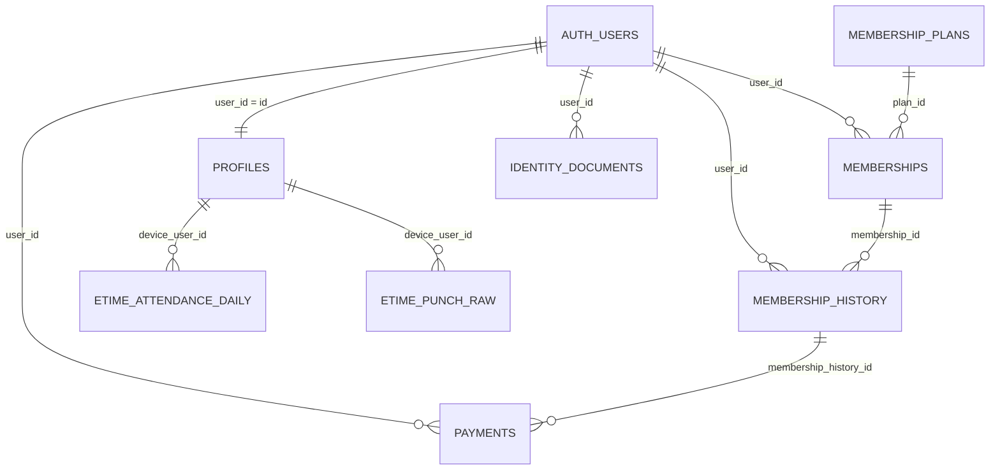

# Supabase — registration, tables, device link, app backend

This is the **single reference** for the library app's database + backend.

- **Capacity:** ≤ 200 active students → `device_user_id` is an **integer 0–9999** (show as four digits, e.g. `0002`, `1042`).
- **Biometric device** allows up to 7-digit numeric `User ID`; we use **4 digits**, and that number is **the same** as `device_user_id` and **the same** as `Empcode` in the eTime punch API.
- **One canonical ID per person**: `auth.users.id` (UUID) is the join key inside the DB; `device_user_id` (4-digit) is the public label and the device link.
- Works on **iOS, Android, and Web** from the same Supabase project via `@supabase/supabase-js` + Edge Functions.

---

## 1. Full flowchart (read this first)

```mermaid
flowchart TB
  subgraph reg["1. Registration (app or website)"]
    R1[User submits full_name + email/phone + password] --> R2[Supabase Auth inserts auth.users — generates UUID]
    R2 --> R3[Trigger handle_new_user inserts public.profiles<br/>device_user_id = nextval('device_user_id_seq') in range 0–9999]
    R3 --> R4[App shows: Your device user id is 1042<br/>Visit desk for device enrolment]
  end

  subgraph enrol["2. Device enrolment (admin, one time)"]
    E1[Admin types 1042 as User ID on biometric device<br/>and enrols finger/face] --> E2[Admin clicks Mark enrolled in app<br/>profiles.device_enrolled_at = now]
  end

  subgraph buy["3. Buy plan + seat (any time)"]
    B1[User picks plan + seat + start date] --> B2[Edge Function checkout-create creates Razorpay order]
    B2 --> B3[User pays in Razorpay]
    B3 --> B4[Edge Function checkout-verify writes memberships + membership_history]
  end

  subgraph punch["4. Daily punch sync (cron)"]
    P1[Cron Edge Function etime-sync-inout calls DownloadInOutPunchData] --> P2[For each row: Empcode cast to int = device_user_id]
    P2 --> P3[Upsert etime_attendance_daily — FK to profiles.device_user_id]
  end

  subgraph read["5. Apps read (iOS + Android + Web)"]
    A1[Supabase JS client signs in — JWT sub = auth.users.id] --> A2[RLS lets each user read only own rows]
    A2 --> A3[Read profiles, memberships, membership_history, identity_documents]
    A3 --> A4[Read attendance via profiles.device_user_id]
  end

  R4 --> E1
  E2 --> B1
  B4 --> A1
  P3 --> A4
```

---

## 2. The one rule that prevents wrong-user data linkage

> **`device_user_id` (4-digit) = device `User ID` = `Empcode` in punch API**, allocated **once** by a Postgres sequence, **never** changed, **never** reused.

Everything else in this doc enforces that rule.

---

## 3. Architecture — two layers

| Layer | What | You configure |
|-------|------|----------------|
| **`auth` schema** | Supabase Auth: `auth.users`, sessions, JWT | Dashboard → Authentication |
| **`public` schema** | Your app tables (`profiles`, `memberships`, etc.) | SQL migrations + RLS |

Registration inserts **one row in `auth.users`** and (via trigger) **one row in `public.profiles`**. Sign-in inserts nothing — it returns a JWT whose `sub` claim equals `auth.users.id`. Every `public.*` table FKs to `auth.users.id`.

---

## 4. Tables — what they hold and when

| Table | Holds | Written on |
|-------|-------|-----------|
| `auth.users` | Email/phone + password hash + UUID | Registration (Supabase) |
| `public.profiles` | `device_user_id` (4-digit), name, phone, device enrolment flag | Registration (trigger) |
| `public.membership_plans` | Catalog: Full Day, Half Day, Evening, monthly prices | Seed once |
| `public.memberships` | One row per period (active / pending / expired) | After payment |
| `public.membership_history` | Ledger: payments, renewals, refunds (UI history) | After payment |
| `public.payments` | Razorpay order/payment ids + amount | After Razorpay verify |
| `public.identity_documents` | Aadhaar / Student ID pipeline | First upload or on signup |
| `public.etime_attendance_daily` | Daily in/out summary per member | Cron sync from eTime B1 |
| `public.etime_punch_raw` | Every raw punch event | Cron sync from eTime B2 |

---

## 5. Table-by-table reference

### 5.1 `public.profiles` — the member directory

One row per registered user, keyed by the Supabase Auth UUID.

| Column | Type | Required | What goes in |
|---|---|---|---|
| `user_id` | `uuid` PK, FK → `auth.users.id` | Yes | Equals JWT `sub` |
| `device_user_id` | `int` UNIQUE, CHECK `0–9999` | Yes | **From `device_user_id_seq`, never hand-set** |
| `full_name` | `text` | Yes | Display name; ideally matches HR `Name` |
| `phone` | `text` | Optional | E.164 like `+919876543210` |
| `email` | `text` | Optional | Mirror of `auth.users.email` for joins |
| `avatar_url` | `text` | Optional | Supabase Storage path |
| `device_enrolled_at` | `timestamptz` | Optional | Set by admin after typing the number on the device |
| `enrolled_by` | `uuid` FK → `auth.users.id` | Optional | Admin who confirmed enrolment |
| `created_at` | `timestamptz` | Yes | `default now()` |
| `updated_at` | `timestamptz` | Yes | trigger on update |

**Connection:** `profiles.user_id` → `auth.users.id` (1:1).
**Immutability:** `device_user_id` cannot be updated (DB trigger).

### 5.2 `public.membership_plans` — the catalog

Seeded by you, not by registration. Mostly read-only at runtime.

| Column | Type | What goes in |
|---|---|---|
| `id` | `text` PK | `'month_full'`, `'month_half'`, `'evening'`, … |
| `title` | `text` | `'Full Day'`, `'Half Day (12h)'`, … |
| `access_tier` | enum `plan_access_tier` | `'full_day' \| 'half_day' \| 'shift_bundle' \| 'hour_bundle'` |
| `duration_days` | `int` | `30`, `90`, `180`, `365` |
| `access_start_time` | `time` | e.g. `08:00:00` for half day |
| `access_end_time` | `time` | e.g. `20:00:00` |
| `price_paise` | `bigint` | `249900` for ₹2,499 |
| `active` | `bool` | `true` to show in app |

### 5.3 `public.memberships` — current and past periods

One row per **paid period** (or pending payment).

| Column | Type | What goes in |
|---|---|---|
| `id` | `uuid` PK | `gen_random_uuid()` |
| `user_id` | `uuid` FK → `auth.users.id` | Who |
| `plan_id` | `text` FK → `membership_plans.id` | What |
| `status` | enum `membership_status` | `'pending_payment' \| 'active' \| 'expiring_soon' \| 'expired' \| 'cancelled'` |
| `starts_at` | `timestamptz` | Begin of period |
| `expires_at` | `timestamptz` | End of period |
| `seat_code` | `text` | e.g. `'A-42'` |
| `floor_label` | `text` | e.g. `'Floor 2 — Quiet zone'` |

### 5.4 `public.membership_history` — the ledger UI shows

Every row corresponds to one card in the “History” screen.

| Column | Type | What goes in |
|---|---|---|
| `id` | `uuid` PK | |
| `user_id` | `uuid` FK → `auth.users.id` | |
| `membership_id` | `uuid` FK → `memberships.id` (nullable) | Empty for adjustments not tied to a period |
| `kind` | enum `history_kind` | `'payment' \| 'renewal' \| 'adjustment'` |
| `title` | `text` | `'Renewal — Full Day'` |
| `occurred_at` | `timestamptz` | Sorted by this |
| `plan_name` | `text` | `'Full Day'` |
| `amount_paise` | `bigint` | `249900` |
| `status` | enum `history_status` | `'paid' \| 'pending' \| 'failed' \| 'refunded'` |
| `period_label` | `text` | `'90 days from renewal date'` |
| `receipt_id` | `text` | `'RCP-9XK2M'` |
| `razorpay_order_id` | `text` | |
| `razorpay_payment_id` | `text` UNIQUE | Idempotency key for webhooks |
| `metadata` | `jsonb` | Anything else |

### 5.5 `public.payments` — Razorpay receipts (optional split)

| Column | What goes in |
|---|---|
| `id` `uuid` PK | |
| `user_id` FK → `auth.users.id` | |
| `membership_history_id` FK → `membership_history.id` | |
| `razorpay_order_id` `text` | From `orders.create` |
| `razorpay_payment_id` `text` UNIQUE | From `payment.captured` webhook |
| `amount_paise` `bigint` | |
| `status` enum | `'paid' \| 'pending' \| 'failed' \| 'refunded'` |
| `raw` `jsonb` | Full Razorpay payload |

### 5.6 `public.identity_documents` — Aadhaar / Student ID

One row per `(user_id, type)` — unique.

| Column | Type | What goes in |
|---|---|---|
| `id` | `uuid` PK | |
| `user_id` | `uuid` FK | |
| `type` | enum `doc_type` | `'aadhaar' \| 'student_id'` |
| `status` | enum `doc_status` | `'not_uploaded' \| 'pending' \| 'verified' \| 'rejected'` |
| `storage_path` | `text` | Supabase Storage object key, e.g. `kyc/<user_id>/aadhaar.jpg` |
| `rejection_reason` | `text` | Filled if admin rejects |
| `updated_at` | `timestamptz` | |

### 5.7 `public.etime_attendance_daily` — daily in/out

One row per `(device_user_id, work_date)`. Empcode in the API equals `device_user_id`.

| Column | Type | What goes in |
|---|---|---|
| `id` | `bigserial` PK | |
| `device_user_id` | `int` FK → `profiles.device_user_id` ON UPDATE CASCADE | From `Empcode` cast to int |
| `work_date` | `date` | From `DateString` |
| `in_time` | `text` | `INTime` (string like `09:12`) |
| `out_time` | `text` | `OUTTime` |
| `work_time` | `text` | `WorkTime` |
| `status` | `text` | `'P'` or `'A'` |
| `remark` | `text` | `Remark` field |
| `raw` | `jsonb` | Whole eTime row |
| `fetched_at` | `timestamptz` | When cron last wrote |

### 5.8 `public.etime_punch_raw` — every punch event

| Column | Type | What goes in |
|---|---|---|
| `id` | `bigserial` PK | |
| `device_user_id` | `int` FK → `profiles.device_user_id` | From `Empcode` |
| `punch_at` | `timestamptz` | From `PunchDate` |
| `mcid` | `text` | Reader / gate id |
| `raw` | `jsonb` | Whole eTime row |

UNIQUE on `(device_user_id, punch_at, mcid)` so re-runs are idempotent.

---

## 6. Registration flow — step by step (what gets written where)

| # | Actor | Action | Table | What is saved |
|---|-------|--------|-------|----------------|
| 1 | User | Submits form (full_name, email/phone, password) | — | — |
| 2 | Client | `supabase.auth.signUp({ email, password, options: { data: { full_name }}})` | **`auth.users`** | UUID, email, password hash, `raw_user_meta_data` |
| 3 | DB | Trigger `on_auth_user_created` runs `handle_new_user()` | **`public.profiles`** | `user_id`, `full_name`, `device_user_id = nextval(seq)` (e.g. `1042`) |
| 4 | App | Reads back profile | — | Shows `Your device user id is 1042` |
| 5 | Admin (later) | Types `1042` on biometric device, enrols finger/face, clicks **Mark enrolled** | **`public.profiles`** | `device_enrolled_at = now()`, `enrolled_by = admin uuid` |

Sign-in does **not** repeat steps 2–3.

---

## 7. Sign-in flow

| # | Actor | Action | What touches the DB |
|---|-------|--------|--------------------|
| 1 | User | Enters email/phone + password | — |
| 2 | Client | `supabase.auth.signInWithPassword(...)` | Read `auth.users`; create session |
| 3 | Client | Reads profile | `select * from profiles where user_id = auth.uid()` |
| 4 | Client | Reads current membership | `select … from memberships where user_id = auth.uid() order by expires_at desc limit 1` |
| 5 | Client | Reads history list | `select … from membership_history where user_id = auth.uid() order by occurred_at desc` |

No new row in `auth.users` is created on sign-in.

---

## 8. Punch ingestion (cron, every X minutes)



If a row arrives with `Empcode=1234` that has no matching `profiles.device_user_id`, the FK **rejects** it — the data never lands in a bad place. Log it and have admin fix the device enrolment.

---

## 9. Backend setup in your Expo app

This is the same code for **iOS, Android, and Web**. Expo Router + `@supabase/supabase-js` is platform-agnostic.

### 9.1 Install

```bash
cd student-app
npm install @supabase/supabase-js @react-native-async-storage/async-storage
npx expo install react-native-url-polyfill
```

### 9.2 Environment variables

In `student-app/.env`:

```
EXPO_PUBLIC_SUPABASE_URL=https://YOUR-PROJECT.supabase.co
EXPO_PUBLIC_SUPABASE_ANON_KEY=eyJhbGciOi...
```

These are **safe to ship in the app bundle** — RLS protects the data. Never put `service_role` here.

### 9.3 `lib/supabase.ts` — the one client

```ts
import 'react-native-url-polyfill/auto';
import AsyncStorage from '@react-native-async-storage/async-storage';
import { createClient } from '@supabase/supabase-js';
import { Platform } from 'react-native';

const url = process.env.EXPO_PUBLIC_SUPABASE_URL!;
const anonKey = process.env.EXPO_PUBLIC_SUPABASE_ANON_KEY!;

export const supabase = createClient(url, anonKey, {
  auth: {
    storage: Platform.OS === 'web' ? undefined : AsyncStorage,
    autoRefreshToken: true,
    persistSession: true,
    detectSessionInUrl: Platform.OS === 'web',
  },
});
```

- On **iOS / Android**, session is stored in `AsyncStorage`.
- On **Web**, the default `localStorage` is used (so leave `storage: undefined`).
- The same `supabase` instance does **auth, DB reads, file uploads, and Edge Function calls** — one library, three platforms.

### 9.4 `lib/api.ts` — thin typed wrappers

Replace the current mock-mode `request()` calls with Supabase calls. Shape stays the same so screens don't change.

```ts
import { supabase } from './supabase';
import type {
  ApiUser, LoginRequest, SignUpRequest,
  Membership, MembershipHistoryEntry, DocumentState,
} from './apiTypes';

export const api = {
  async signUp(req: SignUpRequest) {
    const { error } = await supabase.auth.signUp({
      email: req.email,
      password: req.password,
      options: { data: { full_name: req.name, phone: req.phone } },
    });
    if (error) throw error;
    return { ok: true as const };
  },

  async login(req: LoginRequest): Promise<{ token: string; user: ApiUser }> {
    const { data, error } = await supabase.auth.signInWithPassword({
      email: req.emailOrPhone,
      password: req.passwordOrOtp,
    });
    if (error) throw error;
    const { user, session } = data;
    const profile = await supabase
      .from('profiles')
      .select('full_name, device_user_id, phone')
      .eq('user_id', user!.id)
      .single();
    return {
      token: session!.access_token,
      user: {
        id: user!.id,
        role: 'student',
        name: profile.data?.full_name ?? 'Member',
        email: user!.email ?? undefined,
        phone: profile.data?.phone ?? undefined,
      },
    };
  },

  async membership(): Promise<Membership> {
    const { data: { user } } = await supabase.auth.getUser();
    if (!user) return { status: 'none' };
    const { data } = await supabase
      .from('memberships')
      .select('status, plan_id, expires_at, seat_code, floor_label, membership_plans(title)')
      .eq('user_id', user.id)
      .order('expires_at', { ascending: false })
      .limit(1)
      .maybeSingle();
    if (!data) return { status: 'none' };
    const daysLeft = Math.max(0, Math.ceil(
      (new Date(data.expires_at).getTime() - Date.now()) / 86400000
    ));
    return {
      status: data.status as Membership['status'],
      planName: (data as any).membership_plans?.title,
      expiresAt: data.expires_at,
      daysLeft,
      seatNo: data.seat_code ?? undefined,
      floor: data.floor_label ?? undefined,
    };
  },

  async membershipHistory(): Promise<MembershipHistoryEntry[]> {
    const { data: { user } } = await supabase.auth.getUser();
    if (!user) return [];
    const { data } = await supabase
      .from('membership_history')
      .select('*')
      .eq('user_id', user.id)
      .order('occurred_at', { ascending: false });
    return (data ?? []).map((row) => ({
      id: row.id,
      kind: row.kind,
      title: row.title,
      occurredAt: row.occurred_at,
      planName: row.plan_name ?? undefined,
      amount: row.amount_paise ? `₹${(row.amount_paise / 100).toLocaleString('en-IN')}` : undefined,
      status: row.status,
      periodLabel: row.period_label ?? undefined,
      receiptId: row.receipt_id ?? undefined,
    }));
  },

  async documents(): Promise<DocumentState[]> {
    const { data: { user } } = await supabase.auth.getUser();
    if (!user) return [];
    const { data } = await supabase
      .from('identity_documents')
      .select('type, status, updated_at, rejection_reason')
      .eq('user_id', user.id);
    return (data ?? []).map((d) => ({
      type: d.type,
      status: d.status,
      updatedAt: d.updated_at,
      rejectionReason: d.rejection_reason ?? undefined,
    }));
  },

  async uploadDocument(args: { type: 'aadhaar' | 'student_id'; fileName: string; mimeType: string; base64: string }) {
    const { data: { user } } = await supabase.auth.getUser();
    if (!user) throw new Error('not signed in');
    const path = `kyc/${user.id}/${args.type}-${Date.now()}.${args.fileName.split('.').pop()}`;
    const file = Uint8Array.from(atob(args.base64), (c) => c.charCodeAt(0));
    const { error: upErr } = await supabase.storage.from('kyc').upload(path, file, {
      contentType: args.mimeType, upsert: true,
    });
    if (upErr) throw upErr;
    await supabase.from('identity_documents').upsert(
      { user_id: user.id, type: args.type, status: 'pending', storage_path: path, updated_at: new Date().toISOString() },
      { onConflict: 'user_id,type' },
    );
    return { ok: true as const };
  },

  async createCheckout(planId: string, seat: { seat_code: string; floor_label: string }) {
    const { data, error } = await supabase.functions.invoke('checkout-create', {
      body: { plan_id: planId, seat },
    });
    if (error) throw error;
    return data as { order_id: string; amount_paise: number; key_id: string };
  },
};
```

### 9.5 Update `components/auth/AuthProvider.tsx`

Replace the `clearToken()` cold-start hack with a real session restore:

```ts
useEffect(() => {
  let cancelled = false;
  (async () => {
    const { data } = await supabase.auth.getSession();
    if (cancelled) return;
    if (!data.session) { setAuth({ status: 'signed_out' }); return; }
    const user = await api.me();          // wraps supabase.auth.getUser + profile read
    setAuth({ status: 'signed_in', token: data.session.access_token, user });
  })();
  const { data: sub } = supabase.auth.onAuthStateChange((_event, session) => {
    if (!session) setAuth({ status: 'signed_out' });
  });
  return () => { cancelled = true; sub.subscription.unsubscribe(); };
}, []);
```

---

## 10. Edge Functions — where to put each piece of backend logic

Edge Functions run on Supabase's Deno runtime, are HTTPS endpoints, and can hold **secrets** the app never sees.

| Function | Why it's a function (not direct DB) | Secrets it needs |
|---|---|---|
| `checkout-create` | Creates Razorpay order — needs `RAZORPAY_KEY_SECRET` | Razorpay secret |
| `checkout-verify` | Verifies signature, writes `memberships` + `membership_history` | Razorpay secret + service role |
| `razorpay-webhook` | Idempotent `payment.captured` handler | Webhook secret |
| `etime-sync-inout` | Calls `DownloadInOutPunchData` on a schedule | eTime credentials |
| `etime-sync-punch` | Calls `DownloadPunchDataMCID` | eTime credentials |
| `admin-mark-enrolled` | Sets `device_enrolled_at` only if caller is admin | service role |

Folder layout:

```
student-app/
  supabase/
    functions/
      checkout-create/index.ts
      checkout-verify/index.ts
      razorpay-webhook/index.ts
      etime-sync-inout/index.ts
      etime-sync-punch/index.ts
      admin-mark-enrolled/index.ts
    config.toml
    migrations/
      20260511_init.sql   <- the SQL block in §14
```

Deploy:

```bash
supabase login
supabase link --project-ref YOUR-PROJECT
supabase db push                  # runs migrations
supabase functions deploy checkout-create
supabase secrets set RAZORPAY_KEY_SECRET=xxxx ETIME_USER=xxxx ETIME_PASS=xxxx
```

Schedule the eTime sync function with Supabase Cron (`pg_cron` extension), e.g. every 15 minutes:

```sql
select cron.schedule(
  'etime-sync-inout-15m',
  '*/15 * * * *',
  $$ select net.http_post(
       url := 'https://YOUR-PROJECT.supabase.co/functions/v1/etime-sync-inout',
       headers := jsonb_build_object('Authorization', 'Bearer ' || current_setting('app.functions_token'))
     ) $$
);
```

---

## 11. Why this API works **everywhere** (iOS + Android + Web)

| Layer | Why it's cross-platform |
|---|---|
| **Database REST (PostgREST)** | `https://<project>.supabase.co/rest/v1/` — any HTTPS client (Expo on iOS, Expo on Android, browser, Next.js, Postman) hits the same endpoint |
| **Auth** | `https://<project>.supabase.co/auth/v1/` — JWT works identically on every platform |
| **Edge Functions** | `https://<project>.supabase.co/functions/v1/<name>` — same |
| **Storage** | `https://<project>.supabase.co/storage/v1/object/...` — same |
| **`@supabase/supabase-js`** | Pure TypeScript, runs in **Expo (iOS / Android / Web)**, plain browser, Next.js, Node, Deno |
| **RLS** | Same row-level security policies apply to every client — the security doesn't depend on the platform |

So for a **separate marketing/admin website** (e.g. Next.js), the recipe is the same:

```ts
// website/lib/supabase.ts
import { createClient } from '@supabase/supabase-js';
export const supabase = createClient(
  process.env.NEXT_PUBLIC_SUPABASE_URL!,
  process.env.NEXT_PUBLIC_SUPABASE_ANON_KEY!,
);
```

Same tables, same Edge Functions, same RLS. One Supabase project serves all three clients.

---

## 12. Row-Level Security (summary)

| Table | Policy |
|---|---|
| `profiles` | `select`, `update` where `auth.uid() = user_id` |
| `memberships`, `membership_history`, `payments`, `identity_documents` | same pattern |
| `membership_plans` | `select` for any authenticated user; insert/update only via service role |
| `etime_attendance_daily`, `etime_punch_raw` | client `select` only where `device_user_id = (select device_user_id from profiles where user_id = auth.uid())`; admin reads via service role |
| Admin overrides | A `profiles.is_admin boolean` flag + policies that OR-in `is_admin = true` |

---

## 13. Entity diagram



---

## 14. SQL — paste this into Supabase SQL Editor (in order)

> Run it once in a fresh Supabase project. It is idempotent — safe to re-run.

### 14.1 Extensions, sequence, enums

```sql
create extension if not exists pgcrypto;

create sequence if not exists public.device_user_id_seq
  as integer
  start with 1
  increment by 1
  minvalue 0
  maxvalue 9999
  no cycle;

do $$ begin
  create type plan_access_tier as enum ('full_day','half_day','shift_bundle','hour_bundle');
exception when duplicate_object then null; end $$;

do $$ begin
  create type membership_status as enum ('pending_payment','active','expiring_soon','expired','cancelled');
exception when duplicate_object then null; end $$;

do $$ begin
  create type history_kind as enum ('payment','renewal','adjustment');
exception when duplicate_object then null; end $$;

do $$ begin
  create type history_status as enum ('paid','pending','failed','refunded');
exception when duplicate_object then null; end $$;

do $$ begin
  create type doc_type as enum ('aadhaar','student_id');
exception when duplicate_object then null; end $$;

do $$ begin
  create type doc_status as enum ('not_uploaded','pending','verified','rejected');
exception when duplicate_object then null; end $$;
```

### 14.2 `profiles` + auto-allocate trigger + immutability trigger

```sql
create table if not exists public.profiles (
  user_id            uuid primary key references auth.users (id) on delete restrict,
  device_user_id      int  not null unique check (device_user_id >= 0 and device_user_id <= 9999),
  full_name          text not null,
  phone              text,
  email              text,
  avatar_url         text,
  device_enrolled_at timestamptz,
  enrolled_by        uuid references auth.users (id),
  is_admin           boolean not null default false,
  created_at         timestamptz not null default now(),
  updated_at         timestamptz not null default now()
);

create index if not exists profiles_device_user_id_idx on public.profiles (device_user_id);

create or replace function public.handle_new_user()
returns trigger
language plpgsql
security definer
set search_path = public
as $$
begin
  insert into public.profiles (user_id, full_name, phone, email, device_user_id)
  values (
    new.id,
    coalesce(new.raw_user_meta_data->>'full_name', 'Member'),
    coalesce(new.raw_user_meta_data->>'phone', new.phone),
    new.email,
    nextval('public.device_user_id_seq')
  );
  return new;
end;
$$;

drop trigger if exists on_auth_user_created on auth.users;
create trigger on_auth_user_created
  after insert on auth.users
  for each row execute function public.handle_new_user();

create or replace function public.profiles_lock_device_user_id()
returns trigger language plpgsql as $$
begin
  if new.device_user_id is distinct from old.device_user_id then
    raise exception 'device_user_id is immutable (user_id=%)', old.user_id;
  end if;
  new.updated_at := now();
  return new;
end;
$$;

drop trigger if exists trg_profiles_lock_device_user_id on public.profiles;
create trigger trg_profiles_lock_device_user_id
  before update on public.profiles
  for each row execute function public.profiles_lock_device_user_id();
```

### 14.3 Plans + memberships + history + payments

```sql
create table if not exists public.membership_plans (
  id                text primary key,
  title             text not null,
  access_tier       plan_access_tier not null,
  duration_days     int not null,
  access_start_time time,
  access_end_time   time,
  price_paise       bigint,
  active            boolean not null default true
);

create table if not exists public.memberships (
  id           uuid primary key default gen_random_uuid(),
  user_id      uuid not null references auth.users (id) on delete restrict,
  plan_id      text not null references public.membership_plans (id),
  status       membership_status not null default 'pending_payment',
  starts_at    timestamptz not null,
  expires_at   timestamptz not null,
  seat_code    text,
  floor_label  text,
  created_at   timestamptz not null default now(),
  updated_at   timestamptz not null default now()
);
create index if not exists memberships_user_dates on public.memberships (user_id, starts_at desc);

create table if not exists public.membership_history (
  id                  uuid primary key default gen_random_uuid(),
  user_id             uuid not null references auth.users (id) on delete restrict,
  membership_id       uuid references public.memberships (id),
  kind                history_kind not null,
  title               text not null,
  occurred_at         timestamptz not null default now(),
  plan_name           text,
  amount_paise        bigint,
  currency            text not null default 'INR',
  status              history_status not null default 'pending',
  period_label        text,
  receipt_id          text,
  razorpay_order_id   text,
  razorpay_payment_id text unique,
  metadata            jsonb,
  created_at          timestamptz not null default now()
);
create index if not exists membership_history_user_time on public.membership_history (user_id, occurred_at desc);

create table if not exists public.payments (
  id                    uuid primary key default gen_random_uuid(),
  user_id               uuid not null references auth.users (id),
  membership_history_id uuid references public.membership_history (id),
  razorpay_order_id     text,
  razorpay_payment_id   text unique,
  amount_paise          bigint not null,
  status                history_status not null,
  raw                   jsonb,
  created_at            timestamptz not null default now()
);
```

### 14.4 Identity documents

```sql
create table if not exists public.identity_documents (
  id               uuid primary key default gen_random_uuid(),
  user_id          uuid not null references auth.users (id) on delete cascade,
  type             doc_type not null,
  status           doc_status not null default 'not_uploaded',
  storage_path     text,
  rejection_reason text,
  updated_at       timestamptz not null default now(),
  unique (user_id, type)
);
```

### 14.5 eTime attendance + raw punches

```sql
create table if not exists public.etime_attendance_daily (
  id            bigserial primary key,
  device_user_id int not null references public.profiles (device_user_id) on update cascade,
  work_date     date not null,
  in_time       text,
  out_time      text,
  work_time     text,
  status        text,
  remark        text,
  raw           jsonb not null,
  fetched_at    timestamptz not null default now(),
  unique (device_user_id, work_date)
);

create table if not exists public.etime_punch_raw (
  id            bigserial primary key,
  device_user_id int not null references public.profiles (device_user_id) on update cascade,
  punch_at      timestamptz not null,
  mcid          text,
  raw           jsonb not null,
  unique (device_user_id, punch_at, mcid)
);
```

### 14.6 Row-Level Security

```sql
alter table public.profiles            enable row level security;
alter table public.memberships         enable row level security;
alter table public.membership_history  enable row level security;
alter table public.payments            enable row level security;
alter table public.identity_documents  enable row level security;
alter table public.membership_plans    enable row level security;
alter table public.etime_attendance_daily enable row level security;
alter table public.etime_punch_raw     enable row level security;

-- helper: is current user admin?
create or replace function public.is_admin() returns boolean
language sql stable as $$
  select coalesce((select is_admin from public.profiles where user_id = auth.uid()), false);
$$;

-- profiles: user reads/updates own row; admin reads all
drop policy if exists profiles_self_select on public.profiles;
create policy profiles_self_select on public.profiles for select
  using (auth.uid() = user_id or public.is_admin());

drop policy if exists profiles_self_update on public.profiles;
create policy profiles_self_update on public.profiles for update
  using (auth.uid() = user_id or public.is_admin())
  with check (auth.uid() = user_id or public.is_admin());

-- memberships, history, payments, identity_documents
drop policy if exists memberships_self on public.memberships;
create policy memberships_self on public.memberships for select
  using (auth.uid() = user_id or public.is_admin());

drop policy if exists membership_history_self on public.membership_history;
create policy membership_history_self on public.membership_history for select
  using (auth.uid() = user_id or public.is_admin());

drop policy if exists payments_self on public.payments;
create policy payments_self on public.payments for select
  using (auth.uid() = user_id or public.is_admin());

drop policy if exists identity_documents_self on public.identity_documents;
create policy identity_documents_self on public.identity_documents
  for all using (auth.uid() = user_id or public.is_admin())
  with check (auth.uid() = user_id or public.is_admin());

-- plans: anyone signed-in can read
drop policy if exists plans_read on public.membership_plans;
create policy plans_read on public.membership_plans for select using (auth.role() = 'authenticated');

-- attendance: only your own rows (device_user_id must match your profile)
drop policy if exists attendance_self on public.etime_attendance_daily;
create policy attendance_self on public.etime_attendance_daily for select
  using (
    device_user_id = (select device_user_id from public.profiles where user_id = auth.uid())
    or public.is_admin()
  );

drop policy if exists punch_self on public.etime_punch_raw;
create policy punch_self on public.etime_punch_raw for select
  using (
    device_user_id = (select device_user_id from public.profiles where user_id = auth.uid())
    or public.is_admin()
  );
```

### 14.7 Seed plans (edit prices to your reality)

```sql
insert into public.membership_plans (id, title, access_tier, duration_days, access_start_time, access_end_time, price_paise)
values
  ('month_full',    'Full Day — 1 month',  'full_day',  30,  null,       null,       249900),
  ('month_half',    'Half Day — 1 month',  'half_day',  30,  '08:00',    '20:00',    179900),
  ('month_evening', 'Evening — 1 month',   'shift_bundle', 30, '16:00',  '00:00',     99900),
  ('quarter_full',  'Full Day — 3 months', 'full_day',  90,  null,       null,       699900)
on conflict (id) do nothing;
```

### 14.8 Storage bucket for KYC

In the Supabase dashboard → **Storage**:

1. Create bucket `kyc`, **private**.
2. Add policy:

```sql
-- storage.objects RLS: each user can read/write only files under their own folder
create policy "kyc_user_rw" on storage.objects for all
  using (
    bucket_id = 'kyc'
    and (auth.uid()::text = (storage.foldername(name))[1] or public.is_admin())
  )
  with check (
    bucket_id = 'kyc'
    and (auth.uid()::text = (storage.foldername(name))[1] or public.is_admin())
  );
```

Object naming convention: `kyc/<user_id>/aadhaar-<ts>.jpg`.

### 14.9 Sanity checks (run after first user signs up)

```sql
-- every auth.user should have exactly one profile
select count(*) from auth.users u
left join public.profiles p on p.user_id = u.id
where p.user_id is null;
-- expect 0

-- device_user_id must be unique
select device_user_id, count(*) from public.profiles group by 1 having count(*) > 1;
-- expect 0 rows

-- next number to be issued
select last_value from public.device_user_id_seq;
```

---

## 15. Promotion checklist (do these in order, once)

1. Create Supabase project; copy `URL` + `anon` + `service_role`.
2. Open SQL Editor → paste §14 in order → run.
3. Authentication → Providers → enable Email (+ Phone if needed).
4. Storage → create bucket `kyc` (private) → apply policy from §14.8.
5. `student-app/.env` → add `EXPO_PUBLIC_SUPABASE_URL` + `EXPO_PUBLIC_SUPABASE_ANON_KEY`.
6. `npm install @supabase/supabase-js @react-native-async-storage/async-storage` (+ `expo install react-native-url-polyfill`).
7. Create `lib/supabase.ts` (§9.3) and rewrite `lib/api.ts` (§9.4).
8. Update `AuthProvider` (§9.5).
9. Create Edge Functions (§10) and `supabase secrets set …`.
10. Add `pg_cron` schedule for eTime sync.
11. Pilot with 10 real users — verify §14.9 sanity queries are clean.

---

*End of Supabase reference. Update this file when tables, RLS, or Edge Functions change — it is the single source of truth.*
